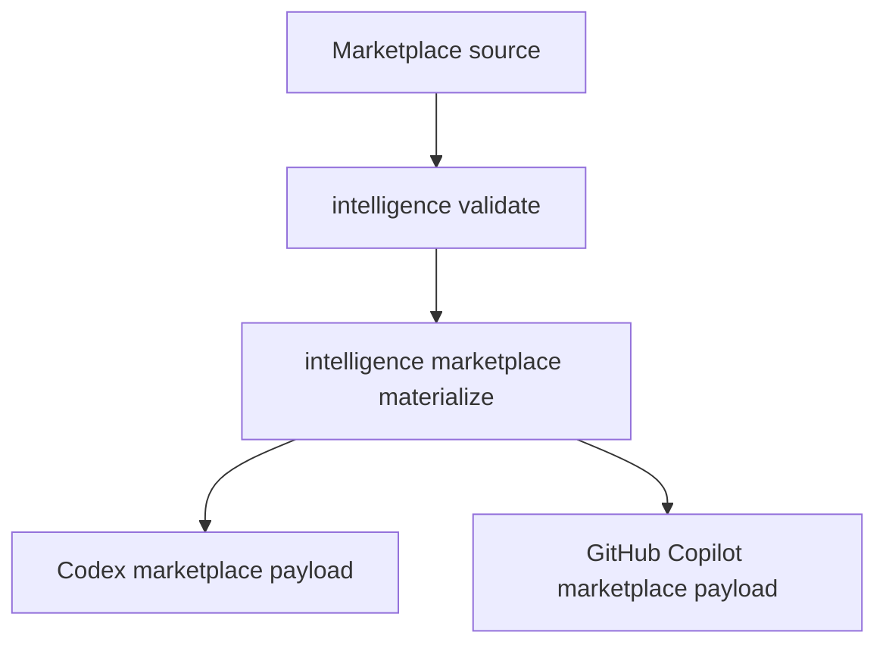

# Marketplace Projection

The CLI projects an authored marketplace repository into provider payloads.
`slopsentral` is the canonical personal marketplace; this repository owns the
projection engine.

## Source Of Truth

| Surface | Owner |
|---|---|
| `source/adaptable.marketplace.json` in `slopsentral` | Marketplace catalog. |
| `source/plugins/*/plugin.json` in `slopsentral` | Plugin composition. |
| `source/skills/`, `source/agents/`, `source/hooks/`, `source/concepts/` in `slopsentral` | Primitive source. |
| `schemas/` in this repo | Validation contracts. |
| `cli/` in this repo | Projection and import behavior. |

Generated marketplace JSON should be refreshed through the CLI, not hand-authored.
