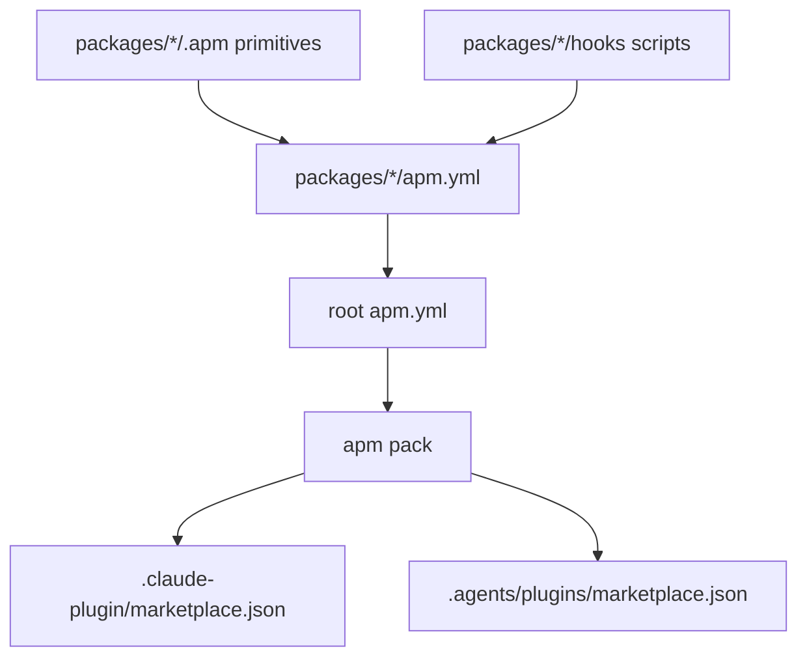

# APM Package Graph

The repository now has one publishing model: APM packages and an APM
marketplace manifest.

## Source Of Truth

| Path | Role |
|---|---|
| `apm.yml` | Marketplace source of truth. |
| `packages/*/apm.yml` | Package source of truth. |
| `packages/*/.apm/` | Primitive source of truth. |
| `.claude-plugin/marketplace.json` | Generated marketplace output. |
| `.agents/plugins/marketplace.json` | Generated marketplace output. |

Generated marketplace JSON should be refreshed through APM, not hand-authored.
