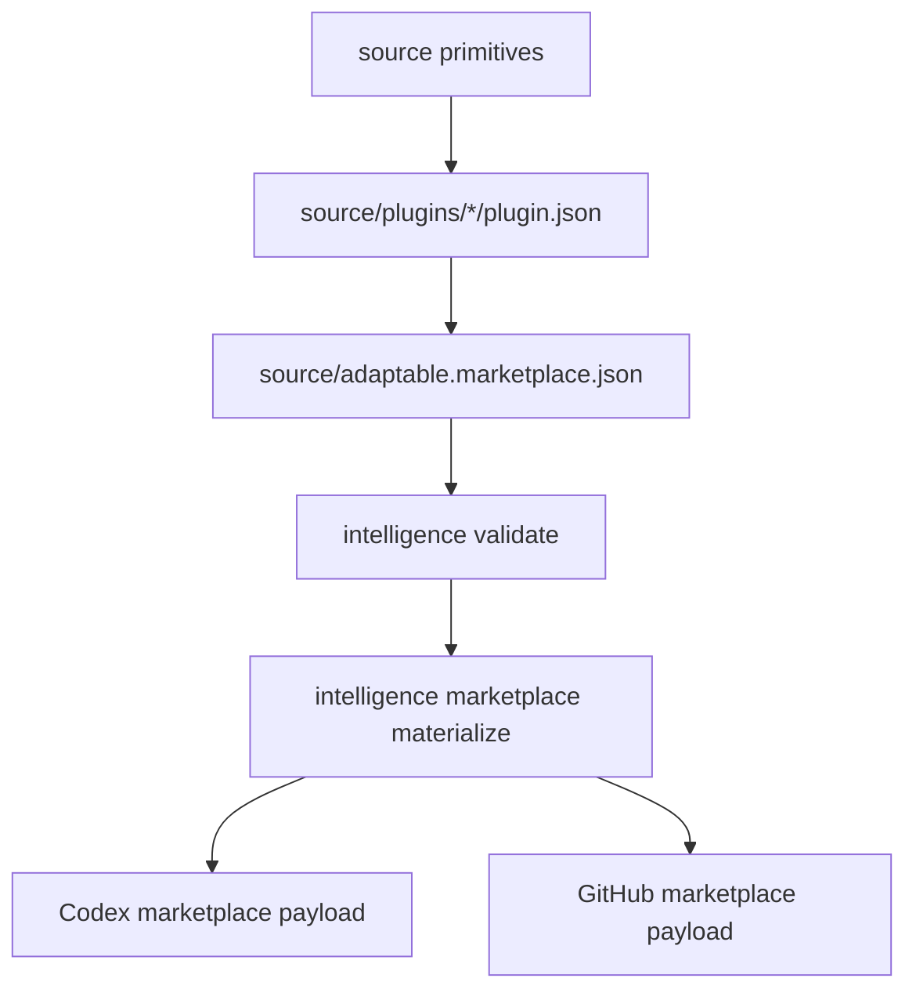

# Source Graph

The repository has one publishing model: source-owned primitives and plugin
manifests are projected into provider marketplace payloads by the Kotlin CLI.

## Source Of Truth

| Path | Role |
|---|---|
| `source/adaptable.marketplace.json` | Marketplace source of truth. |
| `source/plugins/*/plugin.json` | Plugin composition source of truth. |
| `source/skills/` | Skill primitive source of truth. |
| `source/agents/` | Agent primitive source of truth. |
| `source/hooks/` | Hook metadata, scripts, requirements, and adapter source of truth. |
| `source/concepts/` | Portable instruction and principle source of truth. |
| `.agents/plugins/marketplace.json` | Generated Codex marketplace output. |
| `.github/plugin/marketplace.json` | Generated GitHub marketplace output. |

Generated marketplace JSON should be refreshed through the Kotlin CLI, not
hand-authored.
