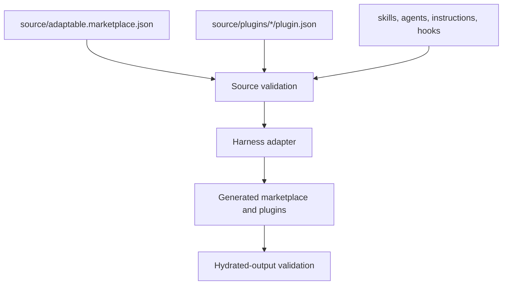

# Projection

Projection converts one provider-neutral source graph into one
harness-specific filesystem tree.

## Source Ownership

The marketplace catalog names plugins and standalone primitives. Plugin
manifests compose skills, agents, instructions, hooks, and supporting files.
Paths are resolved inside the owning source repository, then rewritten to their
generated target locations.

External marketplace references may be resolved as source input. Resolution is
part of obtaining the source graph; it does not install or register a provider
plugin.

## Target Ownership

| Harness | Marketplace entry point | Plugin root |
|---|---|---|
| Codex | `.agents/plugins/marketplace.json` | `.agents/plugins/<plugin>/` |
| GitHub Copilot | `.github/plugin/marketplace.json` | `.github/plugin/<plugin>/` |

Generated files are proof artifacts. Change provider-neutral source or adapter
logic, then project again; do not hand-author the target tree.
