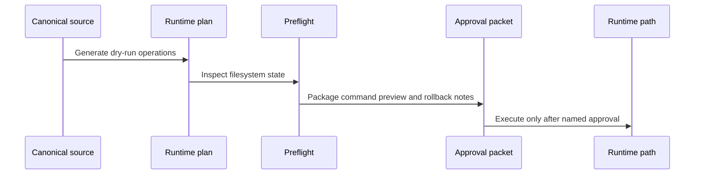

# Runtime Activation

Runtime activation is the process of projecting canonical primitives into local
runtime paths. It is intentionally approval-gated because it can affect files
outside this repository.

## Activation Model

Runtime activation starts as data, not mutation.



## Evidence Files

The activation path is represented by generated manifests and docs.

| File | Purpose |
|---|---|
| `garden/manifests/runtime-links.json` | Planned runtime symlink and marketplace activation targets. |
| `garden/manifests/runtime-activation-plan.json` | Dry-run operations derived from runtime links and cleanup records. |
| `garden/manifests/runtime-activation-preflight.json` | Filesystem state for source paths, targets, backups, and blockers. |
| `garden/manifests/runtime-activation-approvals.json` | Approval packets with command previews and rollback notes. |
| `garden/docs/runtime-activation-approvals.md` | Human-readable packet summary. |

## Approval Boundary

`PROPOSED` records are review data. They do not authorize writes, deletion, or
symlink replacement.

Approve activation by named packet only after the preflight and rollback path
are acceptable.

```sh
bin/intelligence install --repo /path/to/repo \
  --profile .agents/intelligence-profile.json \
  --runtime codex \
  --apply \
  --approve-runtime-link codex-hook-adapters
```

If the activation evidence is stale, regenerate it before approving anything.

```sh
python3 garden/scripts/check-source-graph.py --refresh
```
