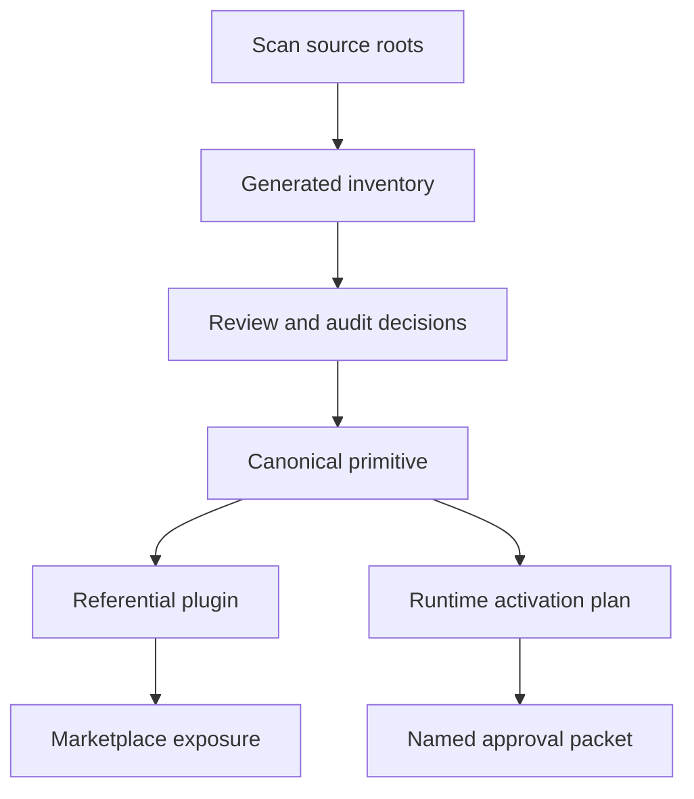

# Source Graph

The source graph records where reusable AI tooling lives, how it is composed,
what evidence supports it, and which runtime outputs are generated from it.

## Authored Sources

Authored sources are the files humans intentionally maintain.

| Source | Role |
|---|---|
| `skills/` | Independent reusable skill primitives. |
| `agents/` | Independent reusable agent profiles. |
| `hooks/` | Hook metadata, implementations, requirements, and adapter configs. |
| `concepts/` | Portable instruction and principle documents. |
| `plugins/*/plugin.json` | Referential composition manifests. |
| `marketplace.json` | Curated provider-neutral marketplace catalog. |
| `profiles/*.json` | Workflow profiles for target repositories. |
| `schemas/` | Public core and adapter schema contracts. |

## Generated Evidence

Generated evidence lives under `garden/manifests/` and `garden/docs/`. It is
produced by scripts under `garden/scripts/`.

Do not hand-edit generated evidence to make a check pass. Update the source or
generator, then rebuild the evidence.

```sh
python3 garden/scripts/check-source-graph.py --refresh
python3 garden/scripts/check-source-graph.py
```

## Review Flow

Promotion and cleanup decisions move through evidence before mutation.



This flow is deliberately explicit. It keeps the repository from confusing
"we found a useful file" with "we can replace every runtime copy now."
