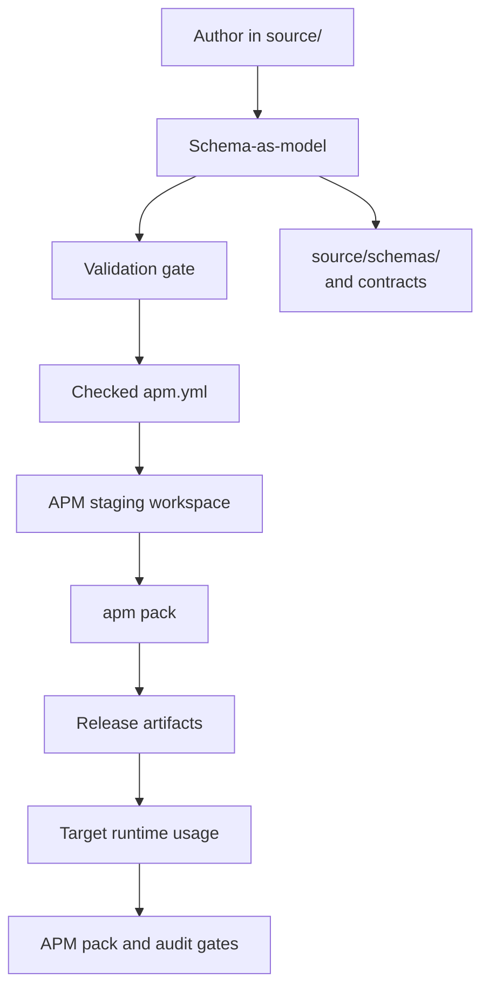

# Source Graph and Normalized Representation

The repository starts from one governing principle:
**a reusable primitive or plugin family is valid only when it has a provider-neutral
JSON form that is enforced by schema.**

That schema becomes the first principle concern because it is the only place where
we state invariant behavior and composition rules. Every concrete marketplace
authoring and adapter surface is derived from this canonical model.

## Canonical source model

The source graph is the authored `source/` graph, normalized to stable kinds and
schemas.

| Source | Canonical role |
|---|---|
| `source/schemas/` | Defines the core grammar and validation boundaries that all
authors must satisfy. |
| `source/skills/` | Independent reusable skill behavior in normalized shape. |
| `source/agents/` | Agent profile primitives bound to explicit schema fields. |
| `source/hooks/` | Hook semantics, requirements, and adapter entrypoints. |
| `source/concepts/` | Portable instruction and principle objects. |
| `source/plugins/*/plugin.json` | Referential composition over existing primitives. |
| `source/adaptable.marketplace.json` | Curated provider-neutral marketplace graph. |
| `apm.yml` | APM marketplace contract generated from the curated source graph. |
| `source/profiles/*.json` | Runtime usage contracts for target repositories. |

This means the graph is a model, not a pile of export targets.

## Benefits and safety from schema-first design

The schema-first approach gives practical safety gains.

| What we optimize for | Safety gain |
|---|---|
| Deterministic behavior | Behavior is declared once in `source/`, so changes are diffed at the source-model layer before any generator or adapter is touched. |
| Host interoperability | APM packages are staged from the source graph, which avoids implicit source-model drift per provider. |
| Failure visibility | Contract violations fail fast through schema gates (`bin/intelligence validate`, `node scripts/validate-manifests.mjs`). |
| Backward compatibility | APM pack reports can be reviewed against the invariant source graph, making unsupported migrations obvious. |
| Recovery under failure | Regenerating the APM workspace from the same source model lets teams fix staging issues without editing historical payloads manually. |

## Target mapping from agnostic representation

Provider markets and local runtimes consume different models. The repository keeps
an agnostic representation in source and maps it outward through APM staging and
packaging.

When a runtime lacks a native concept, the staging step maps the source primitive
into the nearest APM package layout and keeps the canonical shape unchanged.
`build/apm-marketplace/` is generated from `source/` and ignored by Git.

## Practical workflow for contributors

Before moving from source to adapters, keep this sequence.

1. Author in source paths (for example `source/skills`, `source/plugins`, or
   `source/adaptable.marketplace.json`).
2. Run schema gates to ensure the canonical model remains valid.
3. Check `apm.yml` freshness and stage the APM workspace with
   `scripts/prepare-apm-marketplace.py`.
4. Run `apm pack --marketplace=all --dry-run --check-versions --json` from the
   staged workspace.
5. Commit only source edits and the checked APM manifest as durable truth; treat
   `build/apm-marketplace/` as derived output.

This preserves one representation with many targets and makes safety review
simple: if a target model differs unexpectedly, the bug is in the staging path,
not in the canonical source model.
