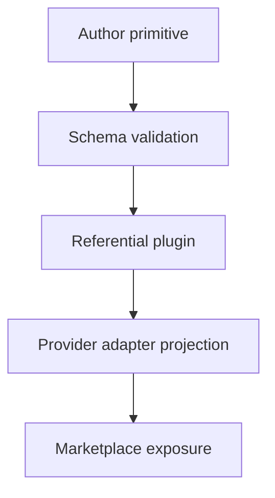

# Source Graph

The source graph records where reusable AI tooling lives and how it is composed
for public distribution.

## Authored Sources

Authored sources are the files humans intentionally maintain.

| Source | Role |
|---|---|
| `skills/` | Independent reusable skill primitives. |
| `agents/` | Independent reusable agent profiles. |
| `hooks/` | Hook metadata, implementations, requirements, and adapter configs. |
| `concepts/` | Portable instruction and principle documents. |
| `plugins/*/plugin.json` | Referential composition manifests. |
| `adaptable.marketplace.json` | Curated provider-neutral marketplace catalog. |
| `profiles/*.json` | Workflow profiles for target repositories. |
| `schemas/` | Public core and adapter schema contracts. |

## Composition Flow

Primitives are authored first. Plugins compose them by reference, and the
marketplace exposes only the curated public subset.

This flow keeps plugin payloads from becoming the only copy of reusable
behavior.

## Adapter Projections

Provider-native marketplaces are generated from the same source graph. When a
runtime does not support a primitive kind directly, the adapter must project it
into the nearest runtime-readable shape instead of changing the source model.

For Codex-style plugin payloads, agent profiles and instruction primitives are
distributed through a generated `AGENTS.md` file. The file points back to the
bundled primitive paths and states that it is an adapter, not a new authority.
