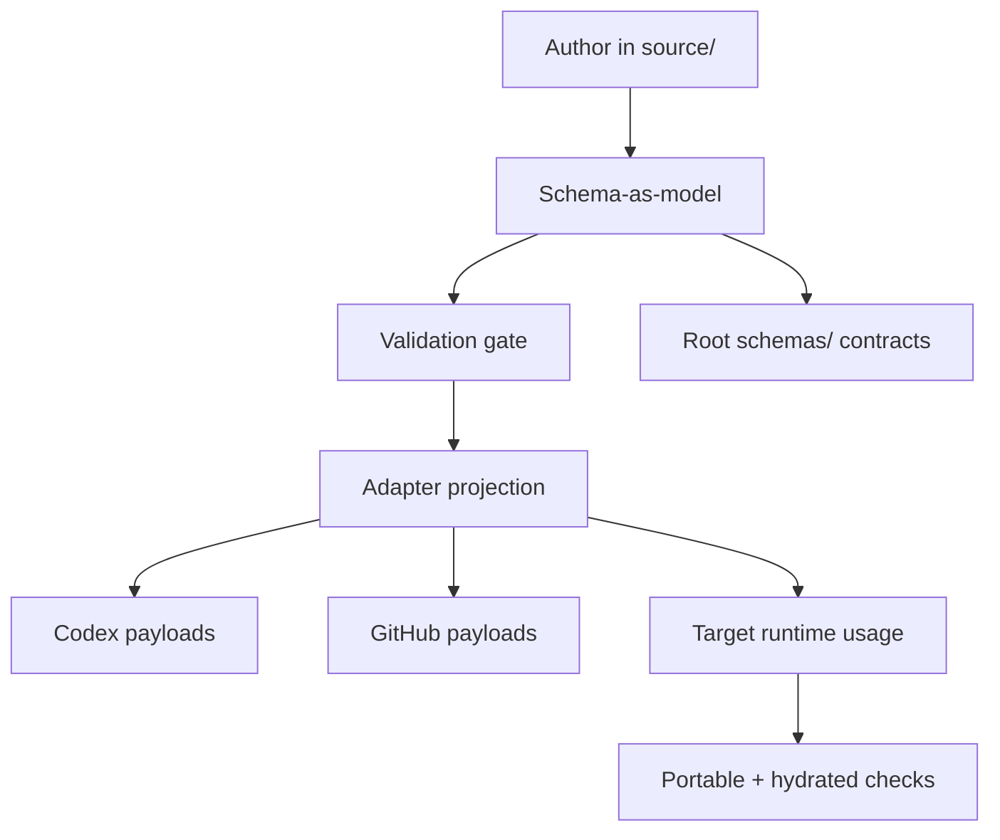

# Source Graph and Normalized Representation

The repository starts from one governing principle:
**a reusable primitive or plugin family is valid only when it has a provider-neutral
JSON form that is enforced by schema.**

That schema becomes the first principle concern because it is where we state
invariant behavior and composition rules. The contracts live at root `schemas/`
so the repository shape is visible before entering authored content. Every
concrete marketplace authoring and adapter surface is derived from this
canonical model.

## Canonical source model

The source graph is the authored `source/` graph, normalized to stable kinds and
schemas.

| Source | Canonical role |
|---|---|
| `schemas/` | Defines the core grammar and validation boundaries that all
authors must satisfy. |
| `source/skills/` | Independent reusable skill behavior in normalized shape. |
| `source/agents/` | Agent profile primitives bound to explicit schema fields. |
| `source/hooks/` | Hook semantics, requirements, and adapter entrypoints. |
| `source/concepts/` | Portable instruction and principle objects. |
| `source/plugins/*/plugin.json` | Referential composition over existing primitives. |
| `source/adaptable.marketplace.json` | Curated provider-neutral marketplace graph. |
| `.intelligence/marketplace-lock.json` | Resolved imported marketplace references and integrity evidence. |
| `source/profiles/*.json` | Runtime usage contracts for target repositories. |

This means the graph is a model, not a pile of export targets.

## Benefits and safety from schema-first design

The schema-first approach gives practical safety gains.

| What we optimize for | Safety gain |
|---|---|
| Deterministic behavior | Behavior is declared once in `source/`, so changes are diffed at the source-model layer before any generator or adapter is touched. |
| Host interoperability | Providers are supported as projections, not forks, which avoids implicit source-model drift per provider. |
| Failure visibility | Contract violations fail fast through the Kotlin CLI validation gate (`intelligence validate`). |
| Backward compatibility | Generated projections can be reviewed against the invariant source graph, making unsupported migrations obvious. |
| Recovery under failure | Regenerating targets from the same source model lets teams fix generator issues without editing historical payloads manually. |

## Target mapping from agnostic representation

Provider markets and local runtimes consume different models. The repository keeps
an agnostic representation in source and maps it outward through deterministic
projections.

When a runtime lacks a native concept, we project into the nearest practical
representation and keep the canonical shape unchanged. For this repository,
Codex and GitHub Copilot payloads are published to CI-owned default harness
paths on `main`, generated branches, or explicit output directories from
`source/`; they are not independent sources.

## Practical workflow for contributors

Before moving from source to adapters, keep this sequence.

1. Author in source paths (for example `source/skills`, `source/plugins`, or
   `source/adaptable.marketplace.json`).
2. Run schema gates to ensure the canonical model remains valid.
3. Materialize provider outputs with the Kotlin CLI and hydrate-check them with
   `--portable --hydrated` so adapter assumptions are explicitly tested.
4. Commit source edits as truth; treat generated surfaces as derived, even when
   CI commits refreshed default harness payloads.

This preserves one representation with many targets and makes safety review
simple: if a target model differs unexpectedly, the bug is in the adapter path,
not in the canonical source model.
