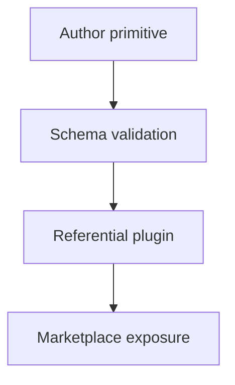

# Source Graph

The source graph records where reusable AI tooling lives and how it is composed
for public distribution.

## Authored Sources

Authored sources are the files humans intentionally maintain.

| Source | Role |
|---|---|
| `skills/` | Independent reusable skill primitives. |
| `agents/` | Independent reusable agent profiles. |
| `hooks/` | Hook metadata, implementations, requirements, and adapter configs. |
| `concepts/` | Portable instruction and principle documents. |
| `plugins/*/plugin.json` | Referential composition manifests. |
| `marketplace.json` | Curated provider-neutral marketplace catalog. |
| `profiles/*.json` | Workflow profiles for target repositories. |
| `schemas/` | Public core and adapter schema contracts. |

## Composition Flow

Primitives are authored first. Plugins compose them by reference, and the
marketplace exposes only the curated public subset.

This flow keeps plugin payloads from becoming the only copy of reusable
behavior.
