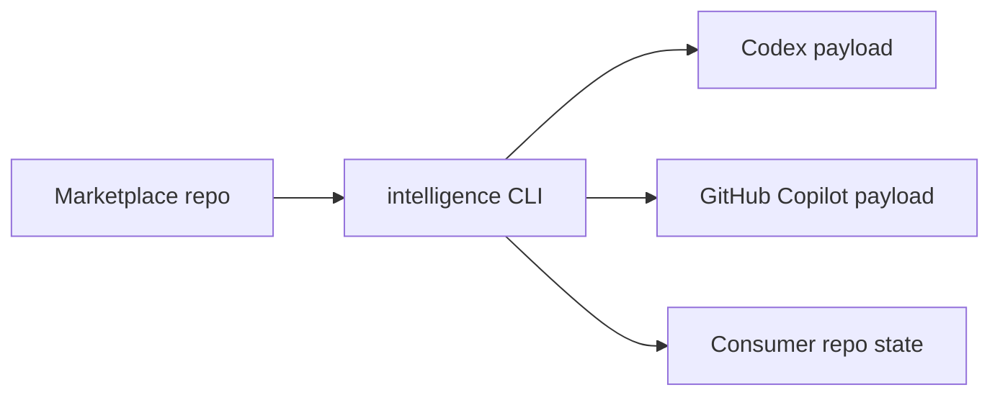

# amichne-intelligence

`amichne-intelligence` is the CLI and schema contract layer for portable AI
tooling marketplaces. The reusable personal marketplace source now lives in
[`amichne/slopsentral`](https://github.com/amichne/slopsentral).



## Start Here

Browse the canonical marketplace from the installed CLI.

```sh
intelligence marketplace browse amichne/slopsentral
intelligence marketplace browse amichne/slopsentral --format json
```

Validate this CLI repository when changing code or schema contracts.

```sh
intelligence validate --portable
```

## What You Can Do

| Job | Entry Point | Result |
|---|---|---|
| Inspect marketplace offerings | [What is available](available/index.md) | A pointer to the `slopsentral` plugin and primitive catalog. |
| Operate marketplaces | [Marketplace](getting-started/marketplace.md) | Browse, manage, import, project, and publish portable marketplace offerings. |
| Validate changes | [Validation](how-it-works/validation.md) | CLI, source, and hydrated-output checks before release. |
