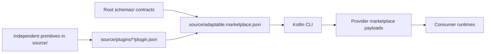

# amichne-intelligence

`amichne-intelligence` is a portable marketplace operator for reusable AI
tooling primitives and plugin families. The source graph is authored under
`source/`, public content contracts live under `schemas/`, and
`source/adaptable.marketplace.json` controls marketplace exposure.



## Start Here

Browse the marketplace from the installed CLI.

```sh
intelligence marketplace browse amichne/intelligence
intelligence marketplace browse amichne/intelligence --format json
```

Validate the source graph when authoring this repository.

```sh
intelligence validate
```

## What You Can Do

| Job | Entry Point | Result |
|---|---|---|
| Inspect plugin families | [What is available](available/index.md) | A map of plugin families and primitives. |
| Operate marketplaces | [Marketplace](getting-started/marketplace.md) | Browse, manage, import, project, and publish portable marketplace offerings. |
| Author a primitive | [Author a primitive](getting-started/author-a-primitive.md) | A source-owned primitive referenced by plugins. |
| Validate publishing | [Validation](how-it-works/validation.md) | Source and hydrated output checks before release. |
