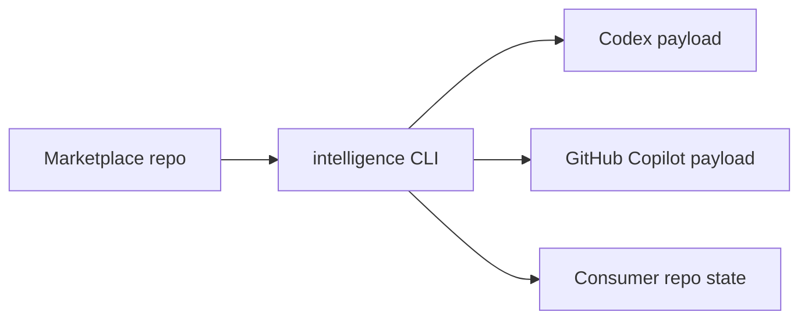

# amichne-intelligence

`amichne-intelligence` is the CLI and schema contract layer for portable AI
tooling marketplaces. The reusable personal marketplace source now lives in
[`amichne/slopsentral`](https://github.com/amichne/slopsentral).



## Start Here

Open the terminal UI from the repository that should receive marketplace
intent. The browser is the primary path for exploring, selecting, installing,
updating, pinning, and validating marketplace content by hand.

```sh
intelligence
```

From the browser, use `:browse amichne/slopsentral`, `/` to search, `:import`
or `:install all` to open an install confirmation, and `:validate` before
trusting the resulting repository state.

Use command output only when scripting or checking this CLI repository itself.

```sh
intelligence marketplace browse amichne/slopsentral --format json
intelligence validate --portable
```

## What You Can Do

| Job | Entry Point | Result |
|---|---|---|
| Use the marketplace browser | [Terminal UI](getting-started/tui.md) | TUI-first search, preview, import, install, update, pin, and validate workflows. |
| Inspect marketplace offerings | [What is available](available/index.md) | A pointer to the `slopsentral` plugin and primitive catalog. |
| Operate marketplaces without the TUI | [Marketplace](getting-started/marketplace.md) | Command-line browse, import, install, project, and publish flows. |
| Validate changes | [Validation](how-it-works/validation.md) | CLI, source, and hydrated-output checks before release. |
