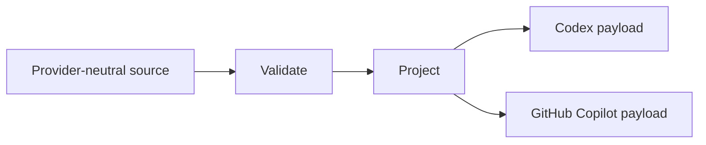

# Intelligence

Intelligence converts a provider-neutral agent-tooling marketplace into the
native files expected by one target harness.



## Start Here

Project one source tree to one harness-specific output directory.

```sh
intelligence project \
  --source /path/to/slopsentral \
  --harness codex \
  --out /tmp/slopsentral-codex
```

Choose `github-copilot` instead of `codex` for the other supported target.

!!! note

    Projection writes generated files only. Intelligence does not install,
    register, publish, discover, or configure the generated material.

## Reader Paths

| Job | Page |
|---|---|
| Run the projector | [Getting started](getting-started/index.md) |
| Understand source-to-target conversion | [Projection](how-it-works/projection.md) |
| Look up the exact CLI | [Command reference](reference/commands.md) |
| Find repository ownership | [Repository map](reference/repository-map.md) |
