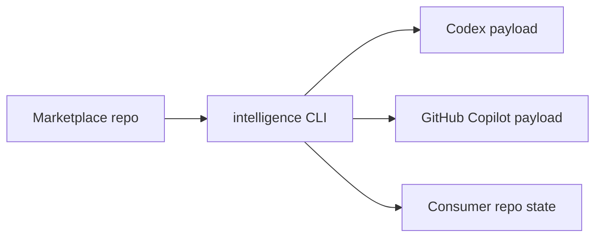

# amichne-intelligence

`amichne-intelligence` is the CLI and schema contract layer for portable AI
tooling marketplaces. The reusable personal marketplace source now lives in
[`amichne/slopsentral`](https://github.com/amichne/slopsentral).



## Start Here

Start with shell discovery from the repository that should receive marketplace
intent. The CLI reports GitHub host configuration, searches repositories through
the active `gh` host, inspects marketplace offerings, and keeps install/update
commands copyable.

```sh
intelligence doctor
intelligence marketplace search kotlin
intelligence marketplace inspect amichne/slopsentral
```

Use JSON when scripting, composing with another program, or checking this CLI
repository itself.

```sh
intelligence marketplace inspect amichne/slopsentral --format json
intelligence validate --portable
```

## What You Can Do

| Job | Entry Point | Result |
|---|---|---|
| Discover from the shell | [Marketplace](getting-started/marketplace.md) | CLI-first search, inspect, import, install, update, pin, and validate workflows. |
| Use the marketplace browser | [Terminal UI](getting-started/tui.md) | Optional full-screen browser over the same RPC boundary. |
| Inspect marketplace offerings | [What is available](available/index.md) | A pointer to the `slopsentral` plugin and primitive catalog. |
| Validate changes | [Validation](how-it-works/validation.md) | CLI, source, and hydrated-output checks before release. |
