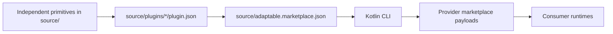

# amichne-intelligence

`amichne-intelligence` is a marketplace-only source graph for reusable AI
tooling primitives and plugin families. The source graph is authored under
`source/`, with `source/adaptable.marketplace.json` controlling marketplace
exposure.



## Start Here

Install the local CLI from the Kotlin build and validate the source graph.

```sh
./gradlew installDevelopmentCli
.local/intelligence/bin/intelligence validate
```

Build the docs site when documentation changes.

```sh
zensical build --clean
```

## What You Can Do

| Job | Entry Point | Result |
|---|---|---|
| Inspect plugin families | [What is available](available/index.md) | A map of plugin families and primitives. |
| Consume the marketplace | [Marketplace](getting-started/marketplace.md) | Provider marketplace materialization commands. |
| Author a primitive | [Author a primitive](getting-started/author-a-primitive.md) | A source-owned primitive referenced by plugins. |
| Validate publishing | [Validation](how-it-works/validation.md) | Source and hydrated output checks before release. |
