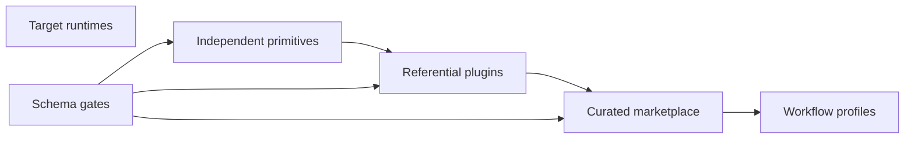

# Intelligence

Intelligence is a public source repository and marketplace for reusable AI
tooling primitives: skills, agents, hooks, instruction concepts, workflow
profiles, schemas, and referential plugin families.

It exists to make reusable agent behavior inspectable and installable. A
primitive remains useful on its own, a plugin composes primitives by reference,
and the marketplace exposes the project-agnostic subset.



## Start Here

Use the repository directly when you want to inspect, compose, publish, or
validate AI tooling. The fastest useful checks are local and executable.

```sh
npm ci
bin/intelligence validate
zensical build --clean
```

The first command installs pinned validation dependencies. The second runs the
repository manifest gate. The third builds this documentation site with
Zensical.

## What You Can Do

The repository supports several related workflows.

| Job | Entry Point | Result |
|---|---|---|
| Understand the toolbox | [What is available](available/index.md) | A map of plugin families, primitives, hooks, and schemas. |
| Add Intelligence to another repo | [Workflow profiles](getting-started/workflow-profiles.md) | A checked-in profile and dry-run install path. |
| Import curated plugins | [Marketplace](getting-started/marketplace.md) | Provider-native marketplace payloads from generated output. |
| Create a new building block | [Author a primitive](getting-started/author-a-primitive.md) | A scaffolded skill, agent, hook, concept, or plugin reference. |
| Keep the source graph honest | [Validation](how-it-works/validation.md) | Schema-backed checks. |

## Why Care

This repository is useful when AI tooling has outgrown one-off prompts and
untracked local files. It gives those tools names, owners, schemas, review
evidence, and installation paths.

It is less useful if you only need a single prompt or a disposable local
experiment. The repository pays off when the same behavior should survive
across repositories, runtimes, machines, or release cycles.
