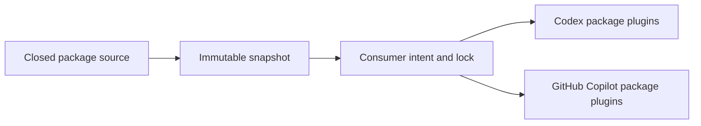

# amichne-intelligence

`amichne-intelligence` is a Kotlin/JVM CLI and schema layer for reproducible,
package-level AI tooling marketplaces. It resolves only exact immutable
snapshots, selects whole packages, records canonical intent and lock evidence,
and projects the same verified packages to Codex or GitHub Copilot.



## Start Here

Every source is explicit and exact. Discovery is read-only and untrusted until
an exact snapshot is inspected.

```sh
intelligence doctor
intelligence marketplace discover --github amichne/slopsentral
intelligence marketplace inspect \
  --github amichne/slopsentral \
  --snapshot SNAPSHOT_ID
```

Use JSON for automation and portable validation for repository proof.

```sh
intelligence marketplace inspect \
  --github amichne/slopsentral \
  --snapshot SNAPSHOT_ID \
  --format json
intelligence validate --portable
```

## What You Can Do

| Job | Entry point | Result |
|---|---|---|
| Discover, inspect, and select exact packages | [Marketplace](getting-started/marketplace.md) | Reproducible intent and lock evidence without version or dependency inference. |
| Understand the package boundary | [What is available](available/index.md) | Whole packages with private supporting assets. |
| Validate changes | [Validation](how-it-works/validation.md) | Source, consumer-state, schema, and distribution checks. |
| Publish the JVM CLI | [Publication](reference/publication.md) | Reproducible Kotlin distribution and release verification. |
